  

<a href="https://k-kiron-terminal.k-iron.chatgpt.site">Open interactive terminal ↗</a> &nbsp;·&nbsp; Try <code>research</code> or <code>skills</code>, then trace a decision.

### `~ / whoami`

I'm **Wenhao XU**, a **Machine Learning PhD student at Université de Montréal & Mila**, working on **rule alignment for language models**.

Do models actually use the rules we give them? I study how explicit rules shape model decisions, with an eye toward AI we can understand and trust.

**AI Safety** &nbsp;·&nbsp; **Alignment** &nbsp;·&nbsp; **Trustworthy AI** &nbsp;·&nbsp; **Mechanistic Interpretability**

### `~ / skills`

I build open-source agent skills that turn "looks good" into something you can inspect, replay, or challenge.

| Skill | What it does |
| :--- | :--- |
| [**RageClick**](https://github.com/K-kiron/RageClick) | Break a web app like an impatient user. Replay the failure. |
| [**SkillClash**](https://github.com/K-kiron/SkillClash) | Find conflicting agent instructions. Trace them to the source. |
| [**RepoQuest**](https://github.com/K-kiron/RepoQuest) | Turn a real bug into a playable debugging mystery. |
| [**PaperCourt**](https://github.com/K-kiron/PaperCourt) | Put empirical ML claims on trial against their evidence. |
| [**ProveIt**](https://github.com/K-kiron/ProveIt) | Check that a regression test actually catches the bug. |

<a href="https://k-kiron.github.io/RepoQuest/">Play RepoQuest →</a> &nbsp;·&nbsp; <a href="https://k-kiron.github.io/RageClick/">Watch RageClick →</a>

### `~ / also-building`

[**TaxAgent**](https://github.com/K-kiron/TaxAgent) — local tax preparation &nbsp; / &nbsp; [**ReviewBudget**](https://github.com/K-kiron/ReviewBudget) — pull request verification planning.

---

Montreal &nbsp; / &nbsp; <a href="https://www.linkedin.com/in/k-kiron/">LinkedIn</a> &nbsp; / &nbsp; <a href="https://github.com/K-kiron?tab=repositories">All repositories ↗</a>
