  

I'm a **PhD student in Computer Science at Université de Montréal**, working on **rule alignment for language models**.

I study how models interpret and apply explicit rules, and how to tell whether those rules actually drive their decisions. My goal is to help make AI systems more reliable, understandable, and worthy of trust.

**Research interests** 
AI Safety &nbsp;·&nbsp; Alignment &nbsp;·&nbsp; Trustworthy AI &nbsp;·&nbsp; Mechanistic Interpretability

## Beyond research

I also build practical software and open-source tools, including [TaxAgent](https://github.com/K-kiron/TaxAgent) and [ReviewBudget](https://github.com/K-kiron/ReviewBudget).

---

Montreal &nbsp;·&nbsp; <a href="https://www.linkedin.com/in/k-kiron/">LinkedIn</a> &nbsp;·&nbsp; <a href="https://github.com/K-kiron?tab=repositories">Explore my work</a>
